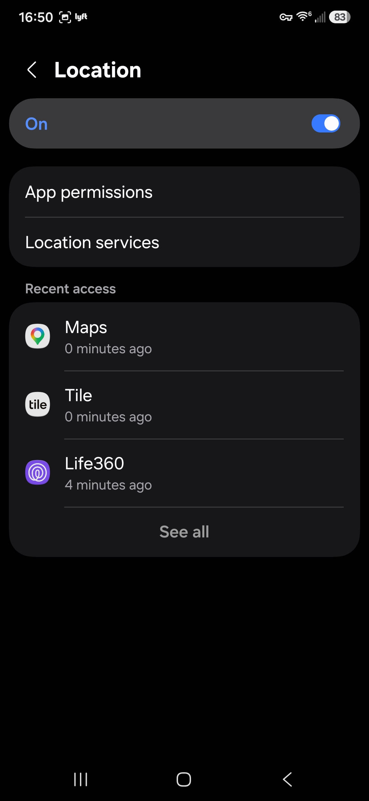
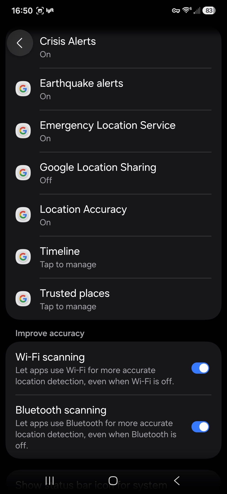
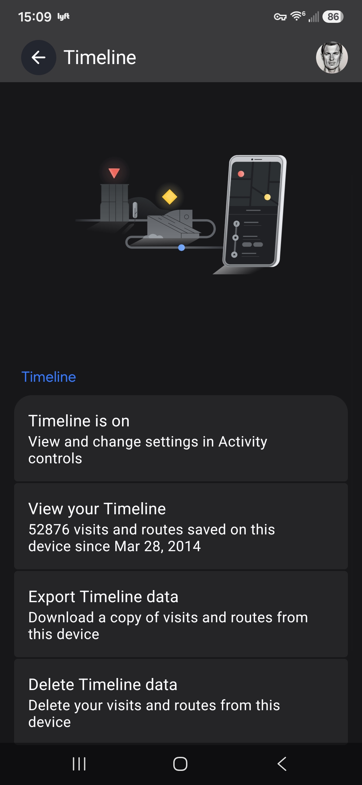

# Exporting Google Timeline Data on Android

This guide walks you through exporting your Google Timeline location history from an Android phone. The exported JSON file is what the Lightroom plugin uses to geotag your photos.

## Prerequisites

- An Android phone with **Google Location History** enabled
- Location history is recorded automatically in the background as long as it is turned on — no special app or action is needed while you are out shooting

## Step 1 — Open Location Settings

Open your phone's **Settings** app and tap **Location**.

Make sure the Location toggle is turned **On**. If it is off, your phone is not recording location history and there will be no data to export.

## Step 2 — Open Location Services

Tap **Location services** to see the list of Google location features on your device.

Scroll down until you see **Timeline** and tap it.

## Step 3 — Export Timeline Data

On the Timeline screen you can see how much data is stored on your device (for example, "52876 visits and routes saved on this device since Mar 28, 2014").

Tap **Export Timeline data** to download a copy of your location history.

Your phone may ask you to confirm with your PIN, password, or biometric authentication before the export begins.

## Step 4 — Transfer the JSON File to Your PC

The export produces a JSON file saved to your phone (typically in the **Downloads** folder). You need to move this file to your PC so the Lightroom plugin can read it.

Use whichever method is most convenient for you:

- **USB cable** — connect your phone to your PC and copy the file from the Downloads folder
- **Cloud storage** — upload the file to Google Drive, OneDrive, or Dropbox, then download it on your PC
- **Email** — email the file to yourself and download the attachment on your PC (note: the file can be large, 100 MB+, which may exceed some email attachment limits)
- **Nearby Share / Quick Share** — wirelessly transfer between your phone and a nearby Windows PC

Once the file is on your PC, remember its location — you will browse to it from the plugin dialog in Lightroom.

## Notes

- The JSON file can be very large if you have years of location history. This is normal and the plugin handles it efficiently.
- You only need to export once for all your existing photos. Export again later if you want to cover new trips.
- The exported data stays on your device and your PC. It is never uploaded anywhere by the plugin.
