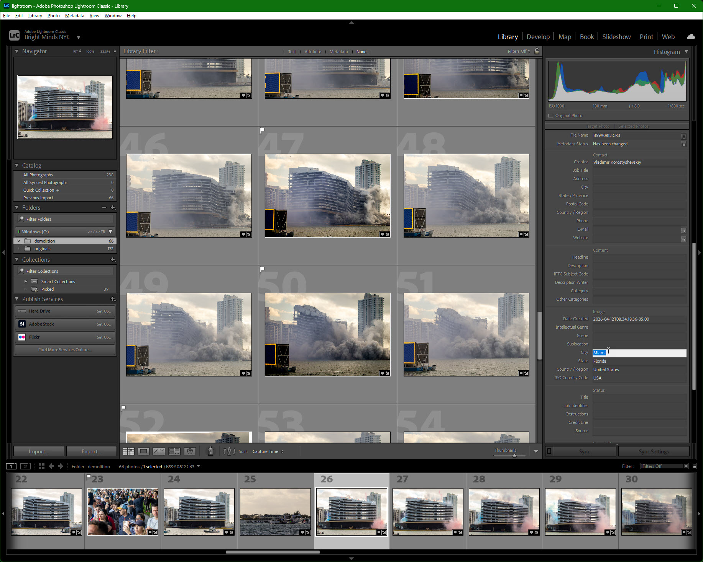
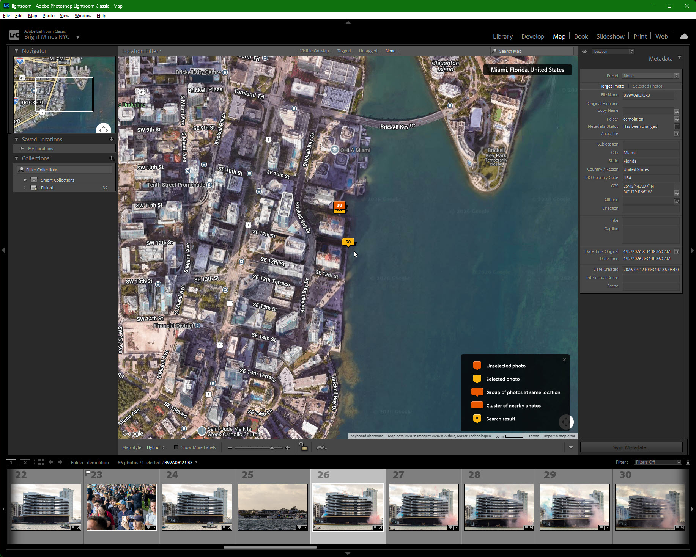
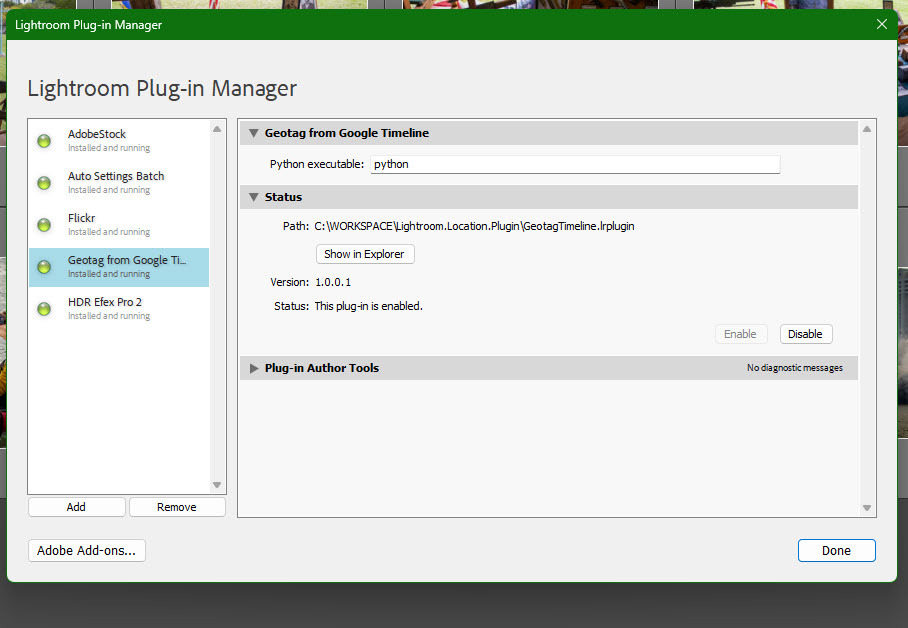
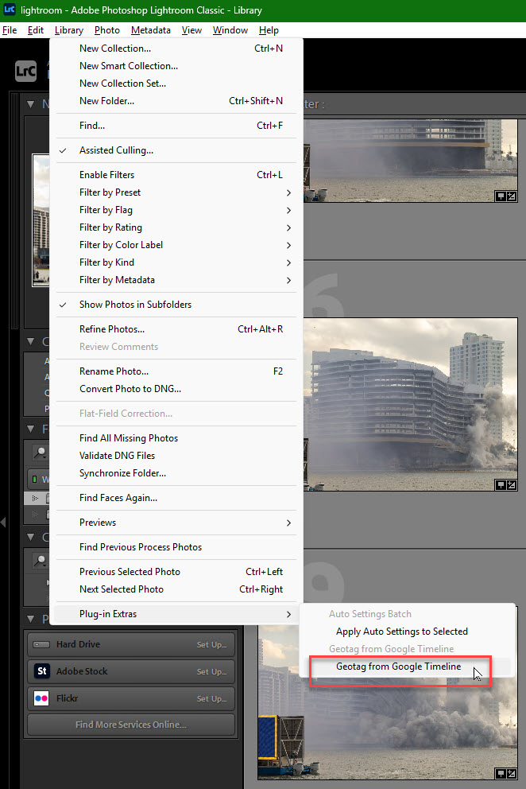
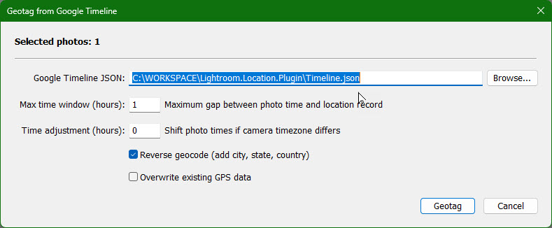

# Geotag from Google Timeline: Lightroom Plugin

A free, open-source Adobe Lightroom plugin that automatically adds GPS coordinates and location names to your photos using your Google Timeline location history.

Many cameras, including high-end bodies like the **Canon EOS R5**, do not record GPS data. That means your photos arrive in Lightroom with no location information: no map pins, no city or country tags, nothing you can search or filter by later.

This plugin solves that problem. If you carry your phone with you while you shoot (and most of us do), Google is already recording where you are. This plugin takes that location history and matches it to the timestamps of your photos, writing GPS coordinates and human-readable location names (city, state, country) directly into the Lightroom catalog. When you export JPEGs, the location data is embedded automatically.



## What the Plugin Does

- Reads your **Google Timeline JSON** export (the location history your phone records in the background)
- Matches each selected photo's capture time to the closest recorded location
- Writes **GPS coordinates** into the Lightroom catalog so photos appear on the Map
- Writes **IPTC location fields** (City, State/Province, Country, and ISO Country Code) so you can search and filter by location name
- All metadata flows through to exported JPEGs automatically



## Requirements

- **Adobe Lightroom** (version 4 or later)
- **Python 3.8+** installed on your computer (no extra packages needed)
- **Google Location History** enabled on your phone

## Step 1. Enable Google Location History

Google Timeline records your location in the background as you go about your day. For this plugin to work, you need Timeline enabled on your Android phone.

To verify it is turned on:

1. Open your phone's **Settings**
2. Tap **Location** and make sure the toggle is **On**
3. Tap **Location services**
4. Find **Timeline** and tap it
5. Confirm that it says **"Timeline is on"**

If Timeline has been on for a while, you should see a count of how many visits and routes have been saved (for example, "52876 visits and routes saved on this device since Mar 28, 2014"). The longer Timeline has been running, the more of your past photo shoots it will cover.

## Step 2. Export Your Timeline Data

You need to export your location history from your phone as a JSON file and transfer it to your PC.

### Export from your Android phone

1. On your phone, go to **Settings > Location > Location services > Timeline**
2. Tap **"Export Timeline data"**
3. Confirm with your PIN, password, or biometric authentication
4. The export produces a JSON file saved to your phone (typically in the Downloads folder)
5. Transfer the file to your PC:
   - **USB cable**: connect your phone and copy the file from Downloads
   - **Cloud storage**: upload to Google Drive, OneDrive, or Dropbox, then download on your PC
   - **Email**: email the file to yourself (note: the file can be 100 MB+ for years of history)
   - **Nearby Share / Quick Share**: wirelessly transfer to a nearby Windows PC

For a detailed walkthrough with screenshots, see the **[Android Export Guide](EXPORT_TIMELINE_ANDROID.md)**.

> **Note:** Google has transitioned Timeline data to on-device storage. The export is done from your phone's Settings, not from the Google Maps website. If you have older location history exported via [Google Takeout](https://takeout.google.com) in JSON format, the plugin supports that format as well.

## Step 3. Install the Plugin

1. Download or clone this repository to your computer
2. Open Lightroom
3. Go to **File > Plug-in Manager**
4. Click **Add** and navigate to the `GeotagTimeline.lrplugin` folder inside this project
5. The plugin should appear as **"Geotag from Google Timeline"** with a green status indicator
6. In the plugin settings panel at the top, verify the **Python executable** path (default is `python`; change it if your Python is installed elsewhere, e.g., `python3` or `C:\Python313\python.exe`)



## Step 4. Geotag Your Photos

1. In the **Library** module, select the photos you want to geotag
2. Go to **Library > Plug-in Extras > Geotag from Google Timeline**

   

3. In the plugin dialog:
   - **Browse** to select your Google Timeline JSON file
   - Set the **Max time window**, the maximum number of hours between a photo's capture time and a location record for them to be considered a match (default: 24 hours; use a smaller value like 1-2 for higher precision)
   - Set **Time adjustment** if your camera's clock was set to a different timezone than what Google Timeline recorded (default: 0)
   - Check **Reverse geocode** to look up city, state, and country names (enabled by default; adds ~1 second per unique location due to API rate limiting)
   - Check **Overwrite existing GPS data** if you want to re-tag photos that already have location information

   

4. Click **Geotag** and wait for processing to complete
5. A summary dialog will show how many photos were tagged, skipped, or had no match

After geotagging, you can verify the results:

- **Metadata panel** (right side in Library) shows City, State, Country, and GPS coordinates
- **Map module** shows geotagged photos as pins on the map

## Supported Timeline Formats

The plugin handles all known Google Timeline JSON formats:

| Format | Source | Key field |
|--------|--------|-----------|
| `semanticSegments` | Current Google Takeout (2024+) | `timelinePath`, `visit` |
| `locations` with `latitudeE7` | Older Google Takeout exports | `timestampMs` |
| `timelineObjects` | Intermediate format | `position`, `activitySegment`, `placeVisit` |

If you have timeline data spanning many years, all formats will be parsed together.

## Tips

- **Smaller time window = more accurate matches.** If you were actively moving, a 1-2 hour window gives better results than 24 hours. If you were stationary all day, a larger window is fine.
- **The plugin remembers your settings** between sessions, so you only need to browse for the JSON file once.
- **Reverse geocoding is cached.** If multiple photos map to the same coordinates, the location name is looked up only once.
- **You can run the plugin multiple times.** Photos that already have GPS data are skipped by default, so you can safely re-run after importing new photos.
- **Timeline JSON files can be large** (100+ MB for years of history). The Python script handles this efficiently using binary search, so matching is fast even with hundreds of thousands of location records.

## Why This Plugin Exists

Lightroom has no built-in way to batch-geotag photos from Google Timeline data. The Map module can load GPX track logs, but Google Timeline exports as JSON, not GPX. Converting between formats requires third-party tools and manual steps. If your camera lacks built-in GPS (which includes most professional bodies like the Canon EOS R5, Sony A7 series, Nikon Z series, and others), your photos arrive in Lightroom with no location data at all.

This plugin fills that gap. It reads the Google Timeline JSON directly, matches photo timestamps to locations using binary search, and writes GPS coordinates plus human-readable location names into the Lightroom catalog. No format conversion, no third-party tools, no manual map-dragging. Select your photos, point the plugin at your Timeline export, and every photo gets its location.

## How This Compares to Other Approaches

As of June 2026, based on an online search of available tools and community discussions, every existing method for using Google Timeline data with Lightroom requires manual format conversion and multiple steps. No other Lightroom plugin reads Google Timeline JSON directly.

| | Existing approaches | This plugin |
|---|---|---|
| Reads Google Timeline JSON directly | No (requires converting JSON to GPX first using tools like GPSBabel or location-history-json-converter) | Yes |
| Works inside Lightroom | Partially (must load GPX track logs in the Map module, then manually auto-tag) | Fully (one-click from the Library menu) |
| Adds city, state, country names | No (only GPS coordinates from track log matching) | Yes (reverse geocodes automatically) |
| Handles all Timeline JSON formats | Varies by converter tool | All three formats (semanticSegments, locations, timelineObjects) |
| External tools required | GPSBabel, Python conversion scripts, or other converters | Only Python (standard library, no pip packages) |

Other tools in this space include [Jeffrey Friedl's Geoencoding Plugin](https://regex.info/blog/lightroom-goodies/gps) (reads GPX/KML, not Google JSON), [geotag](https://github.com/bjoveski/geotag) (command-line tool, not a Lightroom plugin), and [Yore](https://github.com/WrinklyNinja/yore) (desktop utility, archived). All require format conversion or operate outside of Lightroom.

## Building Your Own Version

The most valuable part of this repository is **[CLAUDE_BUILD_INSTRUCTIONS.md](CLAUDE_BUILD_INSTRUCTIONS.md)**. It contains a complete prompt you can paste into [Claude Code](https://docs.anthropic.com/en/docs/claude-code) to generate a working version of this plugin for any operating system and any Lightroom version. You can also use it as a starting point to build a more involved plugin with additional operations. The prompt encodes all the technical decisions, platform-specific workarounds, and SDK pitfalls discovered during development, so Claude can reproduce (or extend) the plugin without you needing to understand the code.

## How It Works (Technical)

1. The Lua plugin collects the capture timestamp of each selected photo from the Lightroom catalog
2. It writes the photo data and settings to a temporary JSON file
3. It calls a bundled Python script (`timeline_matcher.py`) that:
   - Parses the Google Timeline JSON (no external Python packages required)
   - Sorts all location records by timestamp
   - For each photo, uses binary search to find the closest location within the time window
   - Optionally reverse-geocodes coordinates to city/state/country using OpenStreetMap's Nominatim API
4. The Python script writes results to a temporary JSON file
5. The Lua plugin reads the results and writes GPS coordinates and IPTC location fields to the Lightroom catalog using the SDK's `setRawMetadata` API
6. Temporary files are cleaned up automatically

## Project Structure

```
GeotagTimeline.lrplugin/
  Info.lua                 Plugin registration and menu items
  GeotagMenuEntry.lua      Main workflow: collect photos, apply results
  TimelineDialog.lua       Settings dialog UI
  PythonBridge.lua         Lua-to-Python communication via temp files
  JSON.lua                 Minimal JSON encoder/decoder for Lua
  PluginInfoProvider.lua   Plugin Manager settings panel
  timeline_matcher.py      Python script: timeline parsing and matching
```

## Troubleshooting

| Problem | Solution |
|---------|----------|
| "Python script failed (exit code 1)" | Check that Python 3 is installed and the path is correct in Plugin Manager. Run `python --version` in a terminal to verify. |
| No photos matched | Increase the **Max time window**. Check that your Timeline JSON covers the dates of the photos. |
| Wrong locations | Your camera's clock may be off. Use **Time adjustment** to shift photo timestamps. Try small increments (1-2 hours). |
| Plugin not appearing in menu | Make sure the plugin is enabled in **File > Plug-in Manager**. The green dot should be visible. |
| Slow processing | Reverse geocoding adds ~1 second per unique location (API rate limit). Disable it for faster processing if you only need GPS coordinates. |

## License

MIT License. See [LICENSE](LICENSE) for details.
